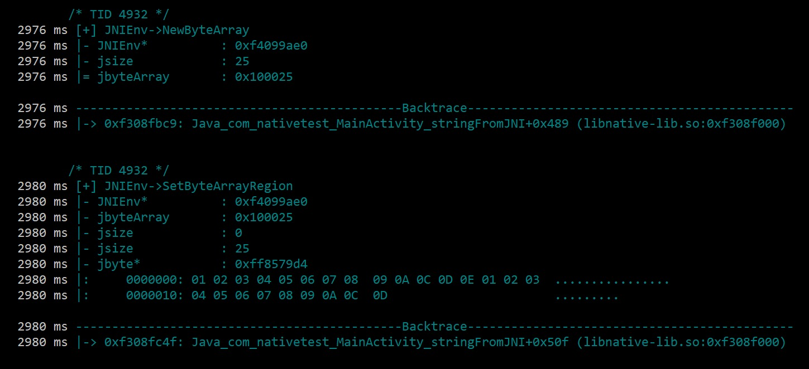
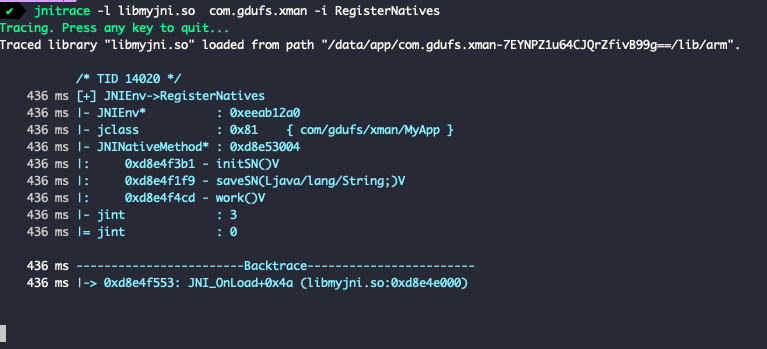

### jnitrace

#### 安装

jnitrace: https://github.com/chame1eon/jnitrace

`pip install jnitrace`

#### 基础用法

ndk 开发是没有办法脱离 [libc.so](http://libc.so) 和 
[libart.so](http://libart.so) 进行开发, 
所以只要降维打击, 通过 trace 的方式就可以监控到 so 层

#### 启动命令

`jnitrace [options] -l libname packagename`

例如 `jnitrace -l [libnative-lib.so](http://libnative-lib.so) com.example.myapplication`

##### 必要参数

- -l libname : 指定要trace的.so文件, 可以同时trace多个.so文件, 直接使用 *来trace所有的.so文件; 如: -l libnative-lib.so -l libanother-lib.so or -l *

- packagename : 指定要trace的package name

##### 可选参数

- `-m`: 指定是spawn还是attach
	
- `-b`: 指定是fuzzy还是accurate
	
- `-i <regex>`: 指定一个正则表达式来过滤出方法名, 例如: -i Get -i RegisterNatives 就只会打印出名字里包含Get或者RegisterNatives的JNI methods
	
- `-e <regex>`和i相反，同样通过正则表达式来过滤，但这次会将指定的内容忽略掉
	
- `-I <string>` trace导出的方法，jnitrace认为导出的函数应该是从Java端能够直接调用的函数，所以可以包括使用RegisterNatives来注册的函数，例如I stringFromJNI -I nativeMethod([B)V，就包括导出名里有stringFromJNI，以及使用RegisterNames来注册，并带有nativeMethod([B)V签名的函数。
	
- `-o path/output.json`，导出输出到文件里。
	
- `-p path/to/script.js`，用于在加载jnitrace脚本之前将指定路径的Frida脚本加载到目标进程中，这可以用于在jnitrace启动之前对抗反调试。
	
- `-a path/to/script.js`，用于在加载jnitrace脚本之后将指定路径的Frida脚本加载到目标进程中
	
- `-ignore-env`，不打印所有的JNIEnv函数
	
- `-ignore-vm`，不打印所有的JavaVM函数

#### 启动方式

默认使用 spawn 启动, 可以通过 -m attach 设置通过 attach 启动

`jnitrace -m attach -l[libnative-lib.so](http://libnative-lib.so) com.kevin.demoso1`

#### 设置回溯器

默认情况下使用 accurate的精确模式来进行回溯, 可以通过 -b fuzzy 修改为模糊模式

`jnitrace -l [libnative-lib.so](http://libnative-lib.so) -b fuzzy com.kevin.demoso1`

#### 监控指定规则的方法

用于指定应该跟踪的方法名, 该选项可以多次提供;

`jnitrace -l libnative-lib.so -i RegisterNatives com.kevin.demoso1`

只过滤出RegisterNatives相关的内容

#### 忽略指定规则的方法

用于指定在跟踪中应被忽略的方法名, 这个选项可以被多次提供;
忽略以Find开头的所有方法;

`jnitrace -l libnative-lib.so -e ^Find com.kevin.demoso`

#### jnitace 计算偏移地址

0x8e4f3b1 是方法 initSN 方法的绝对地址
0xd8e4e000 是 [libmyjni.so](http://libmyjni.so) 基地址
使用使用 initSN()V的绝对地址 0xd8e4f3b1 减去 [libmyjni.so](http://libmyjni.so) 的基地址 0xd8e4e000 , 得到偏移 0x13B1

g 进行跳转到 0x13B1 即可进入方法